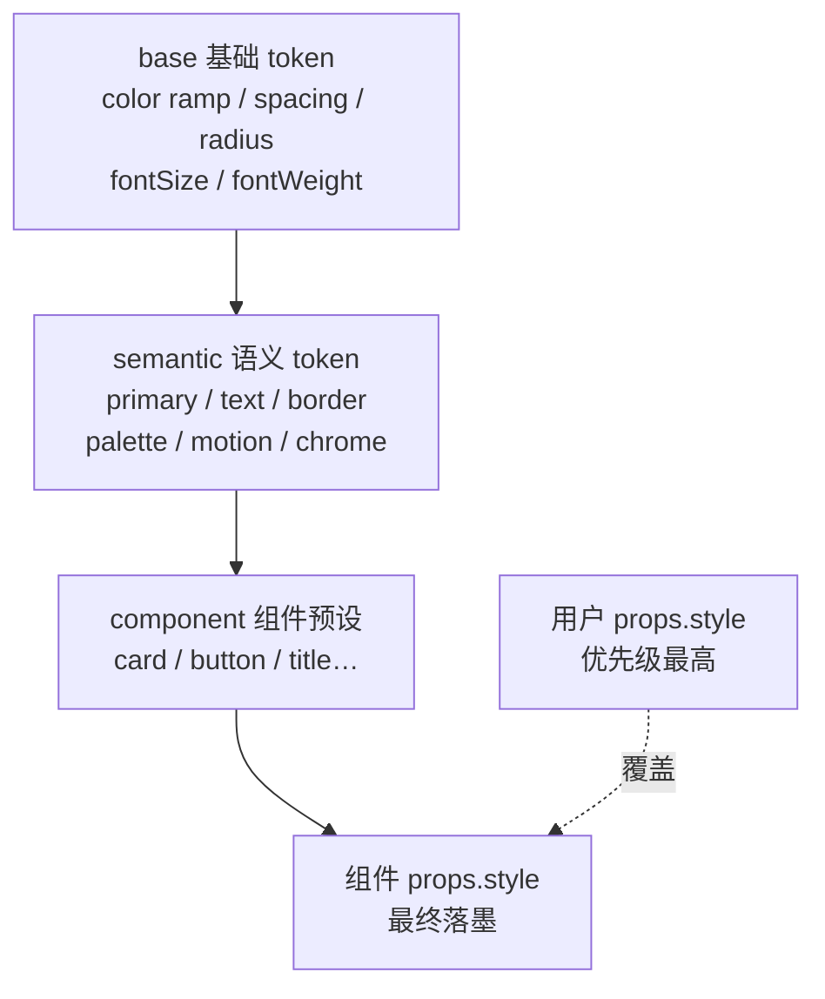

import LiveExample from '@site/src/components/LiveExample';

# · 主题与样式机制（Theme & Style）

## 设计目标

引擎不把颜色 / 间距 / 圆角 / 动效硬编码在组件里，而是抽成一套 **设计 token**；
**引擎提供机制，应用层决定语义** —— 引擎保证「同一个值在任何地方都一致地解析出来」，
但不规定你的品牌色叫什么、什么时候变。



- **① base** —— 原始值：Tailwind 风格色 ramp（blue/emerald/amber/… 50–900）、spacing、radius、fontSize、fontWeight。
- **② semantic** —— 用途语义：primary / success / danger / info / text / muted / border / background / `palette`（数据系列配色）/ `motion`（时长 + 缓动）。**动画系统直接读 `semantic.motion`**（见 [18 · 动画机制](animation-architecture)）。
- **③ chrome** —— **交互外壳**（引擎自己画的那层）：选中框 / 变换手柄 / 连线端点 / 连接插槽 / 对齐引导线 / 连线标签 / 文本选区 / 阴影色 / 调试框 / 蚂蚁线管壁色。以前这些是写死在源码里的十几处色值，深色主题下不会跟着变；现在同属主题，可用 `ice.setChrome({...})` 单独覆盖。
- **④ component** —— 命名预设：把 token 组合成 `card` / `button` / `title` / `gradient` 等可序列化预设，merge 进 `props.style`，随 `setTheme` 热切换重新展开。

**优先级链**：用户 `props` > 组件 `preset` > 主题（semantic / base）> 引擎默认。

## 主题引用：样式在「绘制那一刻」解析

样式里的色值可以直接**引用** token，而不是写死字面量：

```ts
new ICERect({ style: { fillStyle: token('primary'), strokeStyle: '$border' } });

// 渐变 stops 也能引用
new ICERect({
  style: {
    fillGradient: { type: 'linear', from: [0, 0], to: [0, 100], stops: [[0, token('primary')], [1, '$background']] },
  },
});
```

- `token(path)` 是推荐写法（返回 `{ $token }` 的纯对象，可序列化）；字符串简写
  `'$primary'` / `'$palette.2'` / `'$chrome.slot.fill'` / `'$base.radius.md'` 等价。
- **解析发生在 paint 时**，所以 `setTheme()` 之后任意组件（不只是用了 preset 的）都会跟着换 ——
  自定义组件也能跟随主题热切换。
- token 名写错（解析成 `undefined`）时**跳过赋值**、保留 ctx 原值：把 `fillStyle` 赋成 `undefined`
  会让整块画布消失，比"颜色没变"严重得多。
- SVG 导出走同一套解析（否则会出现「画布上有颜色、导出的 SVG 没有」）。

## 交互状态样式

```ts
new ICERect({
  style: { fillStyle: token('background') },
  states: {
    hover: { fillStyle: token('primary'), lineWidth: 2 },
    selected: { strokeStyle: token('primary'), lineWidth: 2 },
    disabled: { globalAlpha: 0.4 },
  },
});
component.setInteractionState('selected', true); // 应用层按自己的语义驱动
```

- 叠加顺序：`基础样式 → focus → hover → active → selected → disabled`（越靠后越优先），
  最后运行时 `state.style` 之上的**状态样式**生效（状态是"当前交互反馈"，按定义应该可见）。
- 引擎可以**自动驱动** hover / active（`ice.enableInteractionStates()`），但**默认关闭** ——
  引擎的 mousemove 本来不做命中检测（高频事件 + 脏矩形渲染），打开它等于给每个移动事件
  加一次场景命中测试，由应用按场景决定值不值。

## 命名主题与实例级切换

主题机制提供「注册表 + 切换」：

- `registerTheme(name, theme)` —— 运行时注入命名主题（多品牌 / 多租户）。内置 `default` + `dark`。
- `setTheme(...)` —— **模块级默认主题**（影响此后新建的 ICE）。
- `ice.setTheme(...)` —— **实例级主题**，不污染模块级当前主题，多实例 / 多品牌各自独立。
- `ice.setChrome(patch)` —— 只改**交互外壳**那一组（保留主题其余部分，只换品牌色手柄这类场景）。
- **子树作用域**：`new ICEGroup({ theme: {...} })` 只影响该子树（分屏大屏 / 暗底卡片）。

主题的**对象写法是部分主题**（深合并），三种形态都支持：
`{ primary: '#0d6efd' }`（平铺 semantic）、`{ semantic: { primary } }`（显式分层）、
`{ base: { radius: { md: 6 } }, motion: { duration: { fast: 50 } } }`（深层局部改）。

两条硬约束：**深合并**（局部改 `motion.duration` 不会抹掉 `motion.easing`）、
**不改原主题**（合并返回新对象，`DEFAULT_THEME` / 已注册主题不会被就地污染）。

`ICETheme.ts` 关键签名（节选，已落地）：

```ts
export function registerTheme(name: string, theme: ICETheme): void;
export function resolveTheme(input: ICEThemeInput, base?: ICETheme): ICETheme;
export function mergeThemes(theme: ICETheme, patch: ICEThemePatch): ICETheme;
export function registerPreset(name: string, factory: StylePresetFactory): void; // 唯一写入口
export function token(path: string): { $token: string };
export function validateTheme(theme: unknown): ThemeDiagnostic[]; // 含 WCAG 对比度
export const STYLE_PRESETS: { [name: string]: StylePresetFactory }; // 只读视图
```

## 主题进快照

```ts
ice.serializer.toJSONString();
// { version, createTime, lastModifyTime, theme: { name: 'dark' } | { name, patch: {...} }, childNodes: [...] }
```

- 只存 **`{ name, patch }`**：`name` 是命名主题基线，`patch` 是**相对它的真实差异**
  （形状与主题同构）；「当初怎么设置的」（整份对象 / 部分补丁 / `setChrome`）不影响存下来的内容。
- 与命名主题一致时只写 `{ name }`；没动过主题不写该字段（旧快照格式不变）。
- 还原时**先切命名主题 → 再叠补丁 → 最后建组件**（preset 与默认样式都是在构造时展开的）。

## 主题校验

```ts
const diagnostics = ice.validateTheme();
// [{ severity: 'error', code: 'low-contrast', message: 'semantic.hint 与背景的对比度只有 2.54:1 …' }]
```

覆盖：未知语义 token（警告）、颜色类型不对 / palette 为空 / motion 缺 duration 或 easing（错误）、
`text` / `muted` / `hint` 与背景的 **WCAG 对比度**（< 3 报错、< 4.5 警告）。
这条检查第一次跑就抓到了引擎自己的默认主题（`hint` 在纯白上只有 2.54:1），默认值已调深一档。

引擎 2.6 起，顶层 semantic 键分两类（此前一律报 warning，文案还写成「引擎不会读它」，是错的）：

- **疑似打错内置名** → `warning` + 候选名字（`primry` → "是不是想写 `primary`？"）；
  判定保守：归一化后同名，或**首字母相同且编辑距离 ≤ 2**；
- **应用自带词汇** → `info`（`ThemeDiagnostic.severity` 因此多了 `'info'`）——
  `token('app.highlight')` 这类引用**是能被解析的**（`tokenValue` 按路径取，不限于内置名单），
  所以它不该被报成问题。

## 主题变更通知（被动跟随）

`setTheme` / `setChrome` 应用完成、缓存失效之后会广播一次变更；订阅用 `ice.onThemeChange(fn)`，
返回的函数即退订：

```ts
const off = ice.onThemeChange(({ theme, previous, kind }) => {
  if (kind !== 'theme') return;             // 'chrome' = 只有交互外壳那组 token 变了
  repaintChrome(theme.semantic.primary);    // 此刻 ice.getTheme() 已是新主题
});
```

订阅者之间**互相隔离**（某个回调抛错只 `console.warn` 一次，不影响主题应用与其它订阅者）；
底层是 `ice.evtBus` 上的 `ICE_EVENT_NAME_CONSTS.THEME_CHANGE`（常量已从包入口导出）。
设计器外壳从引擎主题派生、图表 `theme:'auto'` 跟随引擎明暗，都靠它，不必各自发明同步时机。

## 上层应用怎么接：桥的约定

引擎只提供**机制**，主题的**词汇表归应用层** —— 与 i18n 的边界是同一条原则（引擎不做 i18n，
应用层把最终字符串传进来）。所以"应用各自有一套 token"不是缺陷，而是这套边界的预期形态：
浏览器的 CSS 变量由各站点自己定义，也是同一个道理。

接入时守这几条：

1. **应用的 token 是权威，桥单向**（应用 → 引擎的 `setTheme` / `setChrome`）；引擎**永不反向读**应用词汇。
2. **桥只映射「引擎自己画的那部分」**：基础语义色（引擎默认样式用）+ `chrome`（选中框 / 手柄 /
   插槽 / 引导线 / 连线标签 / 选区 / 阴影色）。不要 1:1 复制应用词汇 —— 两边需求本就不重叠。
3. **每个应用一条桥，放应用仓、带单测**。现有三条：web-components 的 `ICEThemeBridge`、
   ice-chart 的 `chartEngineBridge`、ice-entity-designer 的 `DESIGNER_CHROME`。
4. **不要在应用里再实现一套主题解析**（优先级链 / 作用域 / 状态样式 / 序列化是引擎的职责）。
5. **DSL 里能不能写 `"$token"` 取决于「谁在画」**：引擎绘制的图元能解析（设计器的节点 / 连线样式、
   标签），**应用自绘的颜色**（图表系列是图表自己 `ctx.strokeStyle = color`）解析不了、只能用字面量 ——
   那类应用换主题走它自己的主题字段（如 `option.theme`），再由它的桥转给引擎。
6. **品牌基线（设计语言）是产品决策，别靠合并 token 词汇解决**。选型前家族里三套设计语言并存
   （引擎默认偏 Tailwind 色、chart 与 web-components 用 Bootstrap、设计器 DOM 是 antd）。
   **2026-09-14 已决策：方案① Bootstrap 5 基线** —— 引擎默认语义色对齐 Bootstrap 5
   （`DEFAULT_THEME.semantic.primary = #0D6EFD`），数据系列配色抽成唯一来源 `FAMILY_PALETTE`
   由引擎与 chart 共用，设计器画布外壳改为从引擎主题派生。**这只是"改值"**：三套词汇 / 三条桥的
   结构照旧（上面 1–5 点不变），各产品自有的身份主题（XP / arcade / 高对比）也照旧保留。
   决策记录见 [09 · 路线图](roadmap) 的「家族品牌基线」。

## 关键不变量

1. **时间戳与主题解耦**：序列化用 ISO 8601 UTC（见 [06 · 序列化](serialization)），主题只影响外观，不影响数据。
2. **motion token 同源**：动画配置里 `duration:'normal'` / `easing:'out'` 这类语义名，由 `AnimationManager.__resolveMotion()` 按实例主题解析成数字 / `EasingProgress` 方法名 —— 主题变了缓动语义随之变。
3. **预设可序列化**：预设工厂返回纯对象，写进 `props.style`，主题切换后的外观也能被序列化 / 反序列化还原。
4. **预设表只读**：`STYLE_PRESETS` 是只读视图，注册 / 注销只能走 `registerPreset` / `unregisterPreset` ——
   内置预设不可覆盖、重复注册抛错。同名不同义会让同一份配置在不同工程里画出不同的图。
5. **热路径不付代价**：`applyStyleToCtx()` 每帧每组件都要跑，样式里没有引用、也没有激活状态时走
   与"没有主题机制"时逐字同构的快路径（微基准 0.98× 基线）。

## Live Demo

下方 demo 用 `ice.setTheme('default' | 'dark' | {自定义品牌})` 切换实例主题，色块取自 `ice.theme.semantic.palette`，切换即实时重着色（优先级链：用户未覆盖的部分随主题走，覆盖的部分保持）。

<LiveExample html="/ice-render/examples/theme.html" height={420} note="切换 default / dark / 自定义品牌，观察色板与背景如何随 semantic token 变化" />
