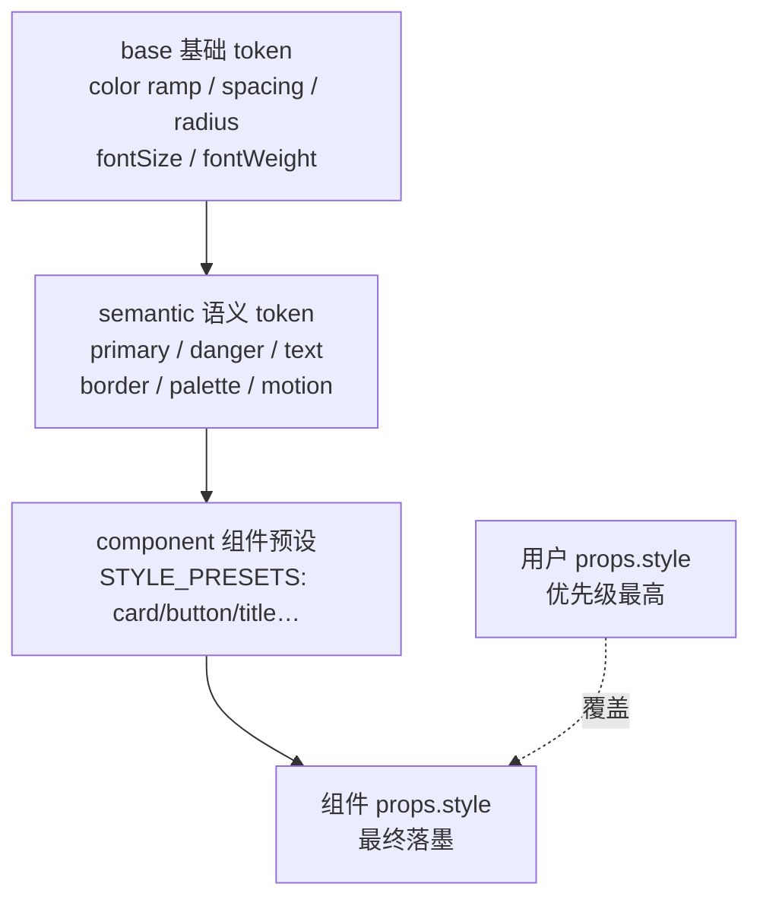

import LiveExample from '@site/src/components/LiveExample';

# · 主题机制（Theme）

## 设计目标

引擎不把颜色 / 间距 / 圆角 / 动效硬编码在组件里，而是抽成一套 **设计 token**，分三层组合：



- **① base** —— 原始值：Tailwind 风格色 ramp（blue/emerald/amber/… 50–900）、spacing、radius、fontSize、fontWeight。
- **② semantic** —— 用途语义：primary / success / danger / info / text / muted / border / background / `palette`（数据系列配色）/ `motion`（时长 + 缓动）。**动画系统直接读 `semantic.motion`**（见 [18 · 动画机制](animation-architecture)）。
- **③ component** —— `STYLE_PRESETS`：把语义 token 组合成 `card` / `button` / `title` / `gradient` 等可序列化预设，merge 进 `props.style`，随 `setTheme` 热切换重新展开。

**优先级链**（对齐 ECharts）：用户 `props` > 组件 `preset` > 语义 `theme` > 基础 `default`。

## 命名主题与实例级切换

主题机制提供「注册表 + 切换」：

- `registerTheme(name, theme)` —— 运行时注入命名主题（多品牌 / 多租户）。内置 `default` + `dark`。
- `setTheme(name | Partial<ICESemanticTheme>)` —— **模块级默认主题**（影响此后新建的 ICE）。
- `ice.setTheme(...)` —— **实例级主题**，`resolveTheme()` 解析但不污染模块级当前主题，因此多实例 / 多品牌各自独立、互不污染。

`ICETheme.ts` 关键签名（节选，已落地）：

```ts
export function registerTheme(name: string, theme: ICETheme): void;
export function resolveTheme(nameOrTheme: string | Partial<ICESemanticTheme>, base?: ICETheme): ICETheme;
export function setTheme(nameOrTheme: string | Partial<ICESemanticTheme>): ICETheme; // 模块级
export const STYLE_PRESETS: { [name: string]: (theme: ICETheme) => any };
```

## 关键不变量

1. **时间戳与主题解耦**：序列化用 ISO 8601 UTC（见 [06 · 序列化](serialization)），主题只影响外观，不影响数据。
2. **motion token 同源**：动画配置里 `duration:'normal'` / `easing:'out'` 这类语义名，由 `AnimationManager.__resolveMotion()` 按实例主题解析成数字 / `EasingProgress` 方法名 —— 主题变了缓动语义随之变。
3. **预设可序列化**：`STYLE_PRESETS` 返回纯对象，写进 `props.style`，因此主题切换后的外观也能被序列化 / 反序列化还原。

## Live Demo

下方 demo 用 `ice.setTheme('default' | 'dark' | {自定义品牌})` 切换实例主题，色块取自 `ice.theme.semantic.palette`，切换即实时重着色（优先级链：用户未覆盖的部分随主题走，覆盖的部分保持）。

<LiveExample html="/ice-render/examples/theme.html" height={420} note="切换 default / dark / 自定义品牌，观察色板与背景如何随 semantic token 变化" />
