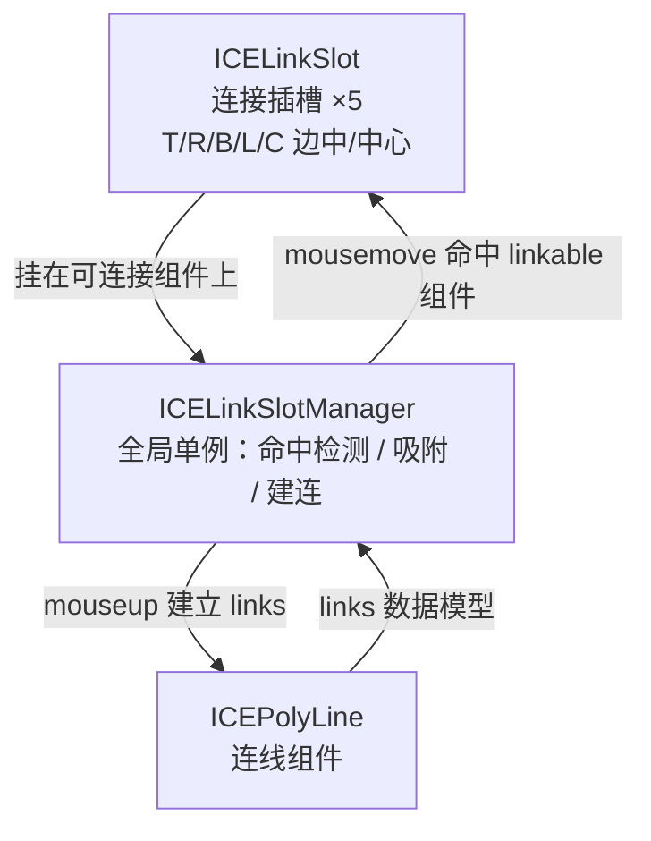

import LiveExample from '@site/src/components/LiveExample';

# · 连线机制（Link）

## 设计目标

引擎提供 Visio 风格的**连接线**：可连接组件在运行时动态挂上「连接插槽」，用户从插槽拖出连线、吸附到目标组件，连线按**数据模型**绑定目标，目标移动时自动跟随。连线本身也是组件（`ICEPolyLine`），支持直线 / 二次 / 三次贝塞尔。

## 三个角色



1. **`ICELinkSlot`** —— 连接插槽。每个可连接组件在 4 条边中点（T/R/B/L）+ 几何中心（C）各挂一个，默认 `display:false`，命中时才显形（绿→黄表示可吸附）。
2. **`ICELinkSlotManager`** —— 全局单例，在 `ICE.init()` 里 `renderer` 之后启动（因为它要监听 renderer 上的事件）。负责：
   - `mousemove` 时**逐帧重新计算**插槽碰撞（拉平整棵树、按 zIndex 排序、只认 `state.linkable && isEffectivelyVisible` 的组件），命中即把 5 个插槽 host 到该组件并显形；
   - `mouseup` 时若钩子与某插槽相交，就把 `{ [position]: { id, position } }` 写进连线的 `links`，建立连接关系；否则断开。
3. **`ICEPolyLine`** —— 连线组件。它的 `links` 字段把「自身某个槽位」映射到「目标组件 id + 目标槽位」，渲染时按目标组件实时槽位坐标自动路由（目标移动连线跟随）。

> 文本校核要点：插槽数在源码注释里写「4 个」，但 `createLinkSlots()` 实际创建 **5 个**（T/R/B/L/C）—— 文档以代码为准。

## 数据模型（与渲染解耦）

连线关系完全由数据描述，**不依赖拖拽过程**，因此可序列化、可程序化重建：

```ts
new ICEPolyLine({
  points: [[x0, y0], [x1, y1]],
  links: {
    R: { id: 'box1', position: 'L' }, // 自身 R 槽 → box1 的 L 槽
  },
  curveType: 'straight' | 'quadratic' | 'cubic',
});
```

`ICELinkSlotManager` 内部建连就是 `linkLine.setState({ links: param })`，断开就是 `links[position] = null`。

## 控制面板的分工（见 [21 · 控制面板](control-panel)）

线条型组件选中时挂的是 `LineControlPanel`（端点手柄），而非 `TransformControlPanel`（旋转 / 缩放手柄）。门控分开：`isLine ? state.linkEditable !== false : state.transformable`。这样「记法不可变换」的连线仍然能拖端点改连接 —— 这是 2026-09-13 修过的一个真实症状（8 个域包曾因 `transformable:false` 连带禁掉端点手柄）。

## Live Demo

两个可连接框 + 一条连线，连线按 `links` 绑定。拖动任一框，连线自动跟随；可切换直线 / 二次贝塞尔、连接 / 断开。

<LiveExample html="/ice-render/examples/link.html" height={460} note="拖动两个框观察连线跟随；端点手柄（linkEditable）可改连接关系" />
