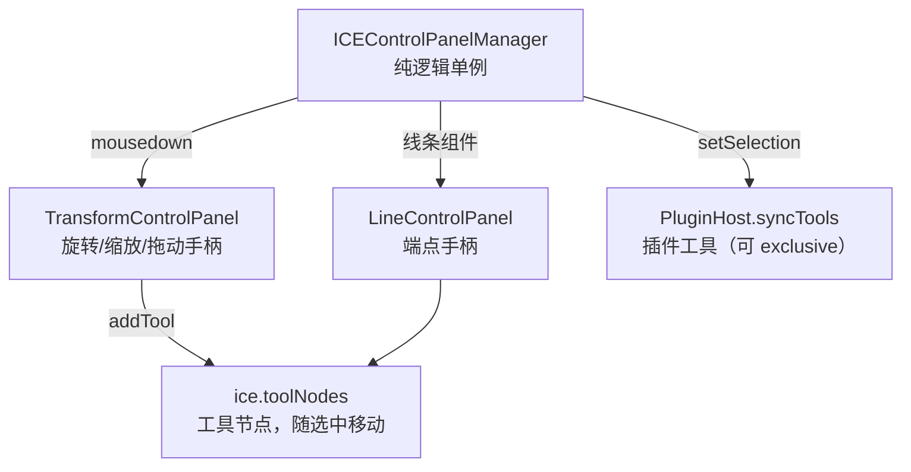

import LiveExample from '@site/src/components/LiveExample';

# · 控制面板机制（ControlPanel）

## 设计目标

选中 / 变换 / 连线端点这类「编辑器交互外壳」与「图元本体」解耦：图元只管画，交互手柄是独立的**工具节点**（`toolNodes`，不参与序列化），由 `ICEControlPanelManager` 在 `mousedown` 时按选中组件动态挂载。

## 结构



- `ICEControlPanelManager` 在 `ICE.init()` 里 `controlPanelManager` 之后启动（`new ... .start()`），监听 `mousedown`。
- 命中组件后走统一选中入口 `ice.setSelection([component])`，并同步插件工具；返回「排他插件工具是否命中」。
- **非线条**组件 → 挂 `TransformControlPanel`（旋转 / 缩放 / resize / 拖动）；**线条组件** → 挂 `LineControlPanel`（端点手柄）。
- 两个面板默认 `disable()`，选中才 `enable()`；点空白处或宿主无 DOM target 时都 `disable()`。

## 门控细节（与 Link 的分工）

```ts
const panelEnabled = component.isLine
  ? component.state.linkEditable !== false   // 连线：看 linkEditable
  : !!component.state.transformable;         // 普通组件：看 transformable
```

`transformable:false` 只禁「旋转/缩放手柄」，**不应**连带禁掉端点手柄 —— 否则用户点连线看不到 hook、也改不了连接（2026-09-13 修复的 8 域包症状）。

## 工具节点 vs 普通组件

- 工具节点用 `ice.addTool()` / `removeTool()` 管理，存在 `ice.toolNodes`，**不参与序列化**（见 [06 · 序列化](serialization) 的 `NON_SERIALIZABLE_KEYS` 与派生子节点处理）。
- 插件工具（`PluginHost.tools`）复用同一套 `toolNodes` 机制，`exclusive:true` 时屏蔽内置面板。

## Live Demo

点击任意图形即选中并显示变换手柄；可拖动手柄变换，或用按钮全选 / 取消选中。

<LiveExample html="/ice-render/examples/control-panel.html" height={460} note="点击图形 → 出现旋转/缩放/拖动手柄；全选多个可批量变换" />
