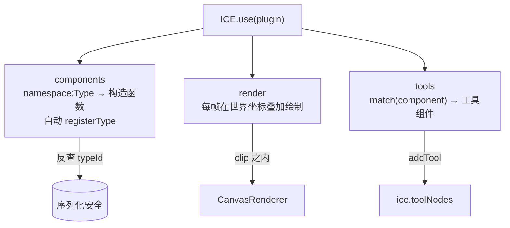

import LiveExample from '@site/src/components/LiveExample';

# · 插件机制（Plugin）

## 设计目标

引擎坚持「只提供原语，不做应用层 UX」（见 [09 · 路线图](roadmap) 的边界）。`PluginHost` 是扩展点：应用 / 第三方通过 `ICE.use(plugin)` 把自定义能力注入引擎，无需 fork。

## 三层注册点

- **① 组件层** `components`：声明自定义图元类型，宿主代为 `registerType`（因此自动获得序列化 `typeId` 反查）。键必须是 `namespace:Type` 格式的 canonical typeId；格式非法或与已注册冲突时**明确抛错**并带上插件名。
- **② 渲染层** `render`：`ICERenderHook = (frame) => void`，每帧在**与组件相同的世界坐标**下叠加绘制。局部重绘帧里回调在 `clip` 之内执行，语义与组件一致（超出脏区域的旧内容不会被擦除也不会重画；若插件内容随时间变化而没有任何组件变脏，引擎因「无脏组件」回退全量，仍然正确）。
- **③ 交互工具层** `tools`：按 `match(component)` 声明自己的工具组件；宿主复用 `toolNodes` 做 add/remove，`exclusive:true` 时禁用内置变换 / 连线面板。

## 生命周期与契约

- `ICE.use(plugin)` **幂等**（按 `name` 去重）→ 调用 `setup(ice)`；`ICE.unuse(name)` → 调用 `teardown(ice)` 并撤销该插件注册的渲染回调与工具。
- **类型注册在 unuse 后保留** —— 反序列化仍可能依赖它，撤销类型会让已存数据失效。
- `render` 钩子签名：`{ ctx, mode:'full'|'dirty-rect', region:number[]|null, width, height }`，`region` 在局部重绘帧为世界坐标脏区、全量帧为 `null`。

## Live Demo

下方「网格插件」通过 `render` 钩子每帧绘制背景网格；`use` / `unuse` 实时挂载 / 卸载，验证渲染层扩展点。

<LiveExample html="/ice-render/examples/plugin.html" height={420} note="点击按钮 use/unuse 网格插件，观察渲染层叠加绘制如何热插拔" />
