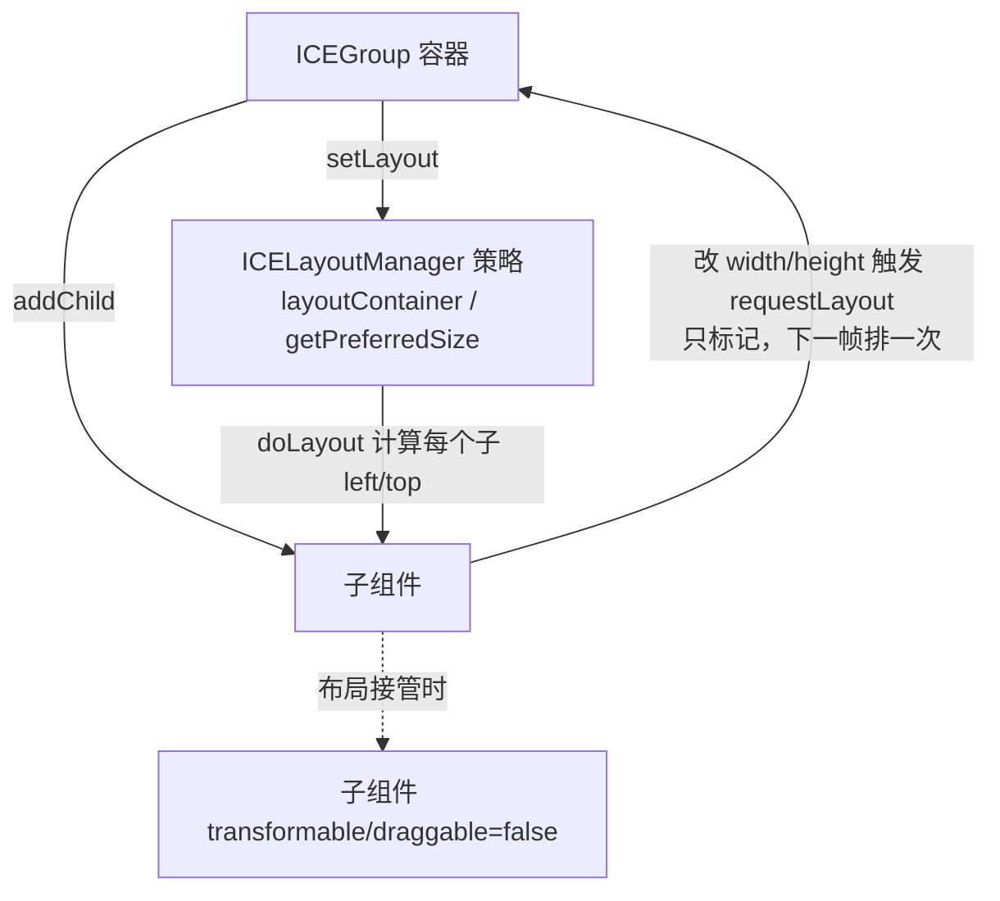

# · 布局机制（Layout）

## 设计目标

容器组件（`ICEGroup` 及其子类）可以持有一个**布局策略**（`ICELayoutManager`），把子组件按某种规则自动排布，而非硬编码坐标。

**设计思想来自 Java Swing 的 `LayoutManager`**：容器持有策略（`setLayout(manager)`）、
策略只管算位置（`layoutContainer(container)`）、可选地报告内容首选尺寸（`getPreferredSize(container)`）
—— 连方法名都是 Swing 的原名。六个容器布局也逐条对齐 Swing 的对应实现：
`FlowLayout` / `GridLayout` / `BorderLayout` / `BoxLayout` / `CardLayout` / `OverlayLayout`。

## 内置布局：抽象基类 + 7 种具体实现

| 类 | 文件 | 语义 | 构造参数（默认值） |
|---|---|---|---|
| `ICELayoutManager` | `ICELayoutManager.ts` | **抽象基类**：只定义 `layoutContainer(container)` 与 `getPreferredSize(container)`；“什么时候重排”由容器（`ICEGroup`）负责，不在基类里 | — |
| `ICEFlowLayout` | `ICEFlowLayout.ts` | 流式：从左到右排列，超出容器宽度则换行（`fitContent` 时排成一行） | `gap=10`、`align='left' \| 'center' \| 'right'` |
| `ICEGridLayout` | `ICEGridLayout.ts` | 网格：按 `cols` 行优先填入，**列宽全局对齐**；支持 `rows` 反推列数与 `gridSpan` 跨格 | `cols=2`（或 `rows`）、`gapX=10`、`gapY=10` |
| `ICEBorderLayout` | `ICEBorderLayout.ts` | 五区：上 / 下 / 左 / 右 / 中；子项用 `state.layoutConstraint` 指定区域（默认 `center`） | `gap=5` |
| `ICEBoxLayout` | `ICEBoxLayout.ts` | 单轴依次排列（不换行）；`grow` 的项按权重瓜分剩余空间 | `axis='x' \| 'y'`、`gap=5` |
| `ICECardLayout` | `ICECardLayout.ts` | **一次只显示一个子项**（其余置 `display:false`），用 `show(i)` / `next()` / `previous()` 切换 | `currentIndex=0` |
| `ICEOverlayLayout` | `ICEOverlayLayout.ts` | 所有子项叠在同一位置（容器左上角） | — |
| `ICELayeredLayout` | `ICELayeredLayout.ts` | **图布局**：读容器里的节点与 `ICEPolyLine` 的连线，按「拓扑分层（最长路径法）→ 层内排序（重心法，减少边交叉）→ 落坐标」排布；面向流程图 / ER 图这类“图”，不是容器流式排版 | `gapX=80`、`gapY=40` |

> `ICECardLayout` 是「同一时刻只显示一个子项」的**容器布局**，与桌面组件里的 Card（标题 + 内容区）不是一回事。
> `ICELayeredLayout` 也是**图布局**，与 z 序无关 —— 它把节点按依赖关系分层摆放。

## 可组合排版：四项能力

这套布局在 2.7 起补上了"能组合进真实界面"的四件事：

| 能力 | 写法 | 语义 |
|---|---|---|
| 按内容自适应 | `new ICEGroup({ fitContent: true })` | 容器把自身尺寸调成 `getPreferredSize()`（内容尺寸）。父容器布局的**测量趟**会先让 `fitContent` 的子容器量好自己（递归、自底向上），所以嵌套容器有**自然尺寸**；`fitContent` 的流式容器排成一行（宽度本来就由内容决定） |
| 内外距 | 容器 `padding`、子项 `margin`（`number` 或 `{top,right,bottom,left}`） | 七个布局统一口径：内容盒扣 padding，子项占位含 margin，落位自动带偏移 |
| 布局 + 交互共存 | `group.setLayout(manager, { disableTransform: false })` | 默认仍是"布局接管后禁用后代拖拽/变换"；传 `false` 时布局照常摆位置但用户可拖（拖完下次重排会被拉回） |
| 剩余空间分配 | 子项 `grow`（箱式）、`gridSpan`（网格） | `grow` 按权重吃剩余空间（容器更小则不压缩）；`gridSpan: { colSpan, rowSpan }` 跨格，表头通栏 / 侧栏跨行不用再手算宽度 |

```ts
// 定宽侧栏 + 自适应内容区 + 带 padding 的容器
const row = new ICEGroup({ width: 560, height: 90, padding: 10 });
row.addChild(new ICERect({ width: 90, height: 60 }));
row.addChild(new ICERect({ width: 60, height: 60, grow: 1 }));
row.addChild(new ICERect({ width: 60, height: 60, grow: 2 }));
row.setLayout(new ICEBoxLayout({ axis: 'x', gap: 10 }));
```

> 完整可跑示例见 `examples/layout/layout-composition.html`。

## 与组件模型的关系



- 容器一旦设定 `layoutManager`，其后代会被**递归禁止手动变换 / 拖动**，位置由布局全权负责。
- `setLayout()` 会把布局**传播给「未显式设置布局」的容器型子组件**（子容器默认继承父层布局），否则它内部的子项不会被排布。

## 什么时候会重排

| 时机 | 行为 |
|---|---|
| `setLayout(manager)` | **立即**排一次 |
| `addChild` / `removeChild` | **立即**重排（新加的要占位、删掉的要补空位）；`addChildren` / `removeChildren` 批量操作只在结束后排一次 |
| 子项改 `width` / `height` | `setState` 的后置钩子检测到尺寸变化 → `parent.requestLayout()` → **只标记**，在本容器**下一帧 `doRender()` 之前**消费（一帧内多次请求合并成一次，避免逐项 `setState` 退化成 O(n²)） |
| `doLayout()` 内部 | 分两趟：**测量趟**先对每个子项 `measure()`（否则首次布局读到的是 0 / 哨兵值），并让 `fitContent` 的子容器把自己量好；**排布趟**再 `layoutContainer()` 落位，最后按需把自身尺寸调成内容尺寸（`fitContent`） |

## 关键 API

```ts
const group = new ICE.ICEGroup({ ... });
group.setLayout(new ICE.ICEFlowLayout({ gap: 12, align: 'left' }));
group.addChild(a); group.addChild(b);   // 加完即排（见上表）
group.doLayout();                        // 也可以手动立即重排一次
group.getPreferredSize();                // 转发给策略：容器内容的首选尺寸（未设布局时为 [0,0]）
```

**布局产物是子组件的 `left/top`**，最终仍走同一套 [03 · 坐标系](coordinate-system) 与
[04 · 渲染](rendering-performance) 管线，所以它和动画能共存。

但**布局与序列化只有一半是通的**，别搞混：

- ✅ **结果**进快照：反序列化后子组件就停在算好的坐标上；
- ❌ **策略**不进快照：`layoutManager` 不在序列化范围内。所以「存盘再读回」之后容器**不再自动排布**，
  要自己重新 `setLayout()` —— 否则之后增删子项不会重排（表现为“新加的子项堆在 0,0”）。

## 现状与边界

布局是「容器原语」的一部分，当前覆盖常见 2D 排版场景；更复杂的约束布局（如自适应拉伸、对齐到基线网格）仍属应用层职责，引擎只给 `requestLayout` 钩子，不做自动求解（见 [09 · 路线图](roadmap)）。
