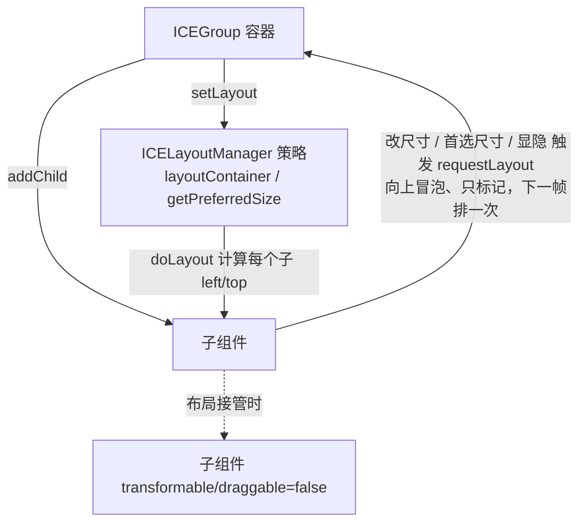

# · 布局机制（Layout）

## 设计目标

容器组件（`ICEGroup` 及其子类）可以持有一个**布局策略**（`ICELayoutManager`），把子组件按某种规则自动排布，而非硬编码坐标。

**设计思想来自 Java Swing 的 `LayoutManager`**：容器持有策略（`setLayout(manager)`）、
策略只管算位置（`layoutContainer(container)`）、可选地报告内容首选尺寸（`getPreferredSize(container)`）
—— 连方法名都是 Swing 的原名。六个容器布局也逐条对齐 Swing 的对应实现：
`FlowLayout` / `GridLayout` / `BorderLayout` / `BoxLayout` / `CardLayout` / `OverlayLayout`。

## 内置布局：抽象基类 + 7 种具体实现

| 类 | 文件 | 语义 | 构造参数（默认值） |
|---|---|---|---|
| `ICELayoutManager` | `ICELayoutManager.ts` | **抽象基类**：只定义 `layoutContainer(container)` 与 `getPreferredSize(container)`；“什么时候重排”由容器（`ICEGroup`）负责，不在基类里 | — |
| `ICEFlowLayout` | `ICEFlowLayout.ts` | 流式：从左到右排列，超出容器宽度则换行（`fitContent` 时排成一行）；`pack: 'first-fit'` 时小件优先回填到还放得下的上一行（"货架装箱"） | `gap=10`、`gapY=gap`、`align='left' \| 'center' \| 'right'`、`crossAlign='start' \| 'center' \| 'end'`、`pack='in-order'` |
| `ICEGridLayout` | `ICEGridLayout.ts` | 网格：按 `cols` 行优先填入，**列宽全局对齐**；支持 `rows` 反推列数与 `gridSpan` 跨格；`cellSizing: 'equal'` 时各格等分容器并把子项摆成格子大小（Swing `GridLayout` 口径） | `cols=2`（或 `rows`）、`gapX=10`、`gapY=10`、`cellSizing='content'` |
| `ICEBorderLayout` | `ICEBorderLayout.ts` | 五区：上 / 下 / 左 / 右 / 中；子项用 `state.layoutConstraint` 指定区域（默认 `center`） | `gap=5` |
| `ICEBoxLayout` | `ICEBoxLayout.ts` | 单轴依次排列（不换行）；`grow` 的项按权重瓜分剩余空间；交叉轴由 `align` 决定（Swing BoxLayout 默认是 `stretch`，引擎默认保持历史行为 `start`） | `axis='x' \| 'y'`、`gap=5`、`align='start' \| 'center' \| 'end' \| 'stretch'` |
| `ICECardLayout` | `ICECardLayout.ts` | **一次只显示一个子项**（其余置 `display:false`），用 `show(i)` / `next()` / `previous()` 切换 | `currentIndex=0` |
| `ICEOverlayLayout` | `ICEOverlayLayout.ts` | 所有子项叠在同一位置（容器左上角） | — |
| `ICELayeredLayout` | `ICELayeredLayout.ts` | **图布局**：读容器里的节点与 `ICEPolyLine` 的连线，按「拓扑分层（最长路径法）→ 层内排序（重心法，减少边交叉）→ 落坐标」排布；面向流程图 / ER 图这类“图”，不是容器流式排版 | `gapX=80`、`gapY=40`、`direction='horizontal' \| 'vertical'`、`crossAlign='start' \| 'center'` |

> `ICECardLayout` 是「同一时刻只显示一个子项」的**容器布局**，与桌面组件里的 Card（标题 + 内容区）不是一回事。
> `ICELayeredLayout` 也是**图布局**，与 z 序无关 —— 它把节点按依赖关系分层摆放。
> 分层算法本身是**纯函数** `computeLayeredLayout({ nodes, edges, ... })`（2.9 起公开导出，
> 返回 `{ left, top, rank, order }`）—— 应用层的编译器（如 DSL 的自动布局）可以直接调它算好坐标写进文档，
> 不必依赖组件与 ctx；`ICELayeredLayout` 只是"调它算坐标 + 写回组件"。

## 对齐 Swing 的三条口径（2.8 起）

2.8 把布局机制按 Java Swing 的三条口径重做了一遍 —— 起因是"父容器挂布局会把策略灌进所有后代容器"，
而组件库里每个组件都是 `ICEGroup` 子类、内部零件（按钮文字、输入框后缀、清除按钮）也在同一棵 `childNodes` 里，
一次 `setLayout()` 等于把整个界面的内部零件重摆一遍。

| 口径 | Swing 对应 | 语义 |
|---|---|---|
| **布局不继承** | `Container.setLayout()` | 父布局只给子容器摆位置；子容器要自动排布就**自己** `setLayout()`。`addChild()` 也不再让新子容器继承父层策略 |
| **自顶向下校验** | `Container.validateTree()` | 排布趟结束后继续向下：谁失效（改过尺寸 / 请求过重排）就重排谁并递归其子树，没失效的子树整棵跳过；中间层容器即使没有布局也要穿过去 |
| **尺寸协商问子项** | `getPreferredSize()` | 父布局调 `child.getPreferredSize()`（不再直接读 `state.width/height`）。子项怎么答：`setPreferredSize()` 声明过 → 报声明值；容器有布局 → 报策略算出的内容尺寸；都没有 → 报自己的盒子。**构造期给的 `width/height` 是边界（`setBounds` 语义），不是首选尺寸** |

配套的四项能力：

| 能力 | 写法 | 语义 |
|---|---|---|
| 按内容自适应 | `new ICEGroup({ fitContent: true })` | 容器把自身尺寸调成 `getPreferredSize()`（内容尺寸）。它现在只是"把自身调成内容尺寸"这个**可选行为** —— 嵌套容器不再需要它也能对外报自然尺寸 |
| 内外距 | 容器 `padding`、子项 `margin`（`number` 或 `{top,right,bottom,left}`） | 七个布局统一口径：内容盒扣 padding，子项占位含 margin，落位自动带偏移 |
| 布局 + 交互共存 | `group.setLayout(manager, { disableTransform: false })` | 默认仍是"布局接管后禁用后代拖拽/变换"；传 `false` 时布局照常摆位置但用户可拖（拖完下次重排会被拉回） |
| 剩余空间分配 | 子项 `grow`（箱式）、`gridSpan`（网格） | `grow` 按权重吃剩余空间（容器更小则不压缩）；`gridSpan: { colSpan, rowSpan }` 跨格，表头通栏 / 侧栏跨行不用再手算宽度 |

```ts
// 定宽侧栏 + 自适应内容区 + 带 padding 的容器
const row = new ICEGroup({ width: 560, height: 90, padding: 10 });
row.addChild(new ICERect({ width: 90, height: 60 }));
row.addChild(new ICERect({ width: 60, height: 60, grow: 1 }));
row.addChild(new ICERect({ width: 60, height: 60, grow: 2 }));
row.setLayout(new ICEBoxLayout({ axis: 'x', gap: 10 }));
```

> 完整可跑示例见 `examples/layout/layout-composition.html`。

## 与组件模型的关系



- 容器一旦设定 `layoutManager`，其后代会被**递归禁止手动变换 / 拖动**，位置由布局全权负责（`disableTransform: false` 可关掉这条）。
- **布局不继承**：`setLayout()` 只作用于本容器，不会传播给子容器；子容器要自动排布，得自己 `setLayout()`。
  判断"要不要排"的是容器自己的失效标记（自顶向下校验趟），不是有没有继承到父层策略。

## 什么时候会重排

| 时机 | 行为 |
|---|---|
| `setLayout(manager)` | **立即**排一次 |
| `addChild` / `removeChild` | **立即**重排（新加的要占位、删掉的要补空位）；`addChildren` / `removeChildren` 批量操作只在结束后排一次 |
| 子项改 `width` / `height` / `setPreferredSize()` | `setState` 的后置钩子检测到变化 → `parent.requestLayout()` → **只标记**，在本容器**下一帧 `doRender()` 之前**消费（一帧内多次请求合并成一次，避免逐项 `setState` 退化成 O(n²)）。`requestLayout()` 会**沿父链向上冒泡**（对齐 Swing `Component.invalidate()`），失效请求不会断在中间层 |
| 子项改 `display`（显隐） | 同尺寸变化一样请求父容器重排（对齐 Swing `Component.setVisible()`）—— 布局器用 `layoutChildren()` 跳过不可见子项；**`GridLayout` 不跳过**（不可见项照样占一格，对齐 Swing） |
| `doLayout()` 内部 | 分两趟：**测量趟**先按 `getPreferredSize()` 协商每个子项的尺寸；**排布趟**再 `layoutContainer()` 落位，最后按需把自身尺寸调成内容尺寸（`fitContent`）。排布趟之后还有一次**自顶向下校验**，让被改过尺寸的内层容器重排自己的子树 |

## 关键 API

```ts
const group = new ICE.ICEGroup({ ... });
group.setLayout(new ICE.ICEFlowLayout({ gap: 12, align: 'left' }));
group.addChild(a); group.addChild(b);   // 加完即排（见上表）
group.doLayout();                        // 也可以手动立即重排一次
group.getPreferredSize();                // 首选尺寸：声明过 → 声明值；有布局 → 策略算出的内容尺寸；否则自己的盒子
group.setPreferredSize([320, 200]);      // 显式声明首选尺寸（Swing 同名 API）
group.getLayout();                       // 当前策略（没设过是 null）
group.setLayout(null);                   // 撤销布局：坐标留在原地、交互锁还原
```

## 自由排版 vs 自由拖动（2.11 起）

设计器类界面（ER / 流程图 / 水务工艺图）里的图元**位置就是数据**，用户必须能拖；而 UI 外壳里的
子项位置该由布局说了算。2.11 把这两件事彻底分开，并补上"位置由布局定、但允许少数子项手动定位"的出口：

| 能力 | 写法 | 语义 |
|---|---|---|
| 交互锁（独立一维策略） | `setLayout(manager, { lockInteraction: false })` / `setInteractionLock(false)` | 只排位置、不接管交互。**解锁按原值还原**（记住改过谁、改前是什么），所以不会把"本来就不可拖"的子项解锁成可拖；`getInteractionLock()` 可读 |
| 手动定位的子项 | 子项 `state.layoutIgnore: true` | 布局**跳过它**（也不计入首选尺寸）—— CSS `position: absolute` 的对应物。"容器负责排布、少数子项位置是数据"由此成立 |
| 最小尺寸 | 子项 `setMinimumSize({ width: 120 })` | 空间不足时，`ICEBoxLayout` 按"能压多少"收缩声明了 `grow` 的子项，压到下限就停（如实溢出，而不是把内容压没）。**没声明的轴回落到首选尺寸 = 不可压缩**，所以既有界面行为不变 |
| 整数分配 | 自动 | 等分网格与 `grow` 的剩余空间用「累计取整」切分：每份整数、总和精确（292/3 → 97/98/97），相邻子项之间不会出现半像素缝 |

```ts
// 例：容器负责排布，但其中一个子项由用户拖动定位
const strip = new ICEGroup({ width: 400, height: 120, padding: 8 });
strip.setLayout(new ICEBoxLayout({ axis: 'y', gap: 6 }), { lockInteraction: false });
strip.addChild(new ICERect({ width: 380, height: 40 }));                 // 布局排
strip.addChild(new ICECircle({ radius: 12, left: 300, top: 70, layoutIgnore: true })); // 用户拖
```

**布局产物是子组件的 `left/top`**，最终仍走同一套 [03 · 坐标系](coordinate-system) 与
[04 · 渲染](rendering-performance) 管线，所以它和动画能共存。

布局**结果与策略都进快照**（2.8 起）：

- ✅ **结果**：子组件的 `left/top` 照旧进快照；
- ✅ **策略**：容器的布局写成 `layout: { type, props }`，读回时按注册的类型重建，之后增删子项照样会重排。
  七种内置布局在 `ICE` 构造时注册（`ice-render:ICEFlowLayout` …），各自 `toJSON()` 只报构造参数；
  自研布局要往返，得先 `ice.registerType('your-ns:MyLayout', MyLayout)` + 实现 `toJSON()`；
  类型没注册时读回**跳过策略、保留坐标**并记入 `deserializer.unknownTypes`（与未注册组件的容错口径一致，不炸整份数据）。

**没注册的布局不会写进快照**（2.11 起，原先是"回退写类名"）：回退写类名看着能读回，但下游打包改名之后
那份数据就是废的（引擎 AGENTS 记过同类事故）。子项的 `left/top` 照旧在快照里，所以读回来**版式不变**、
只是不再自动重排；序列化时会告警提示你 `registerType`。旧快照里已经是类名的数据仍按未注册类型兼容读取。

**组件内部策略用 `toJSON() { return null; }` 声明"不进文档"**（既不写、也不告警）：这类策略由组件在构造时
自己 `setLayout(new XxxLayout())` 重建、参数活在组件的 state 里 —— 组件库的 `ICEMenu` / `ICEWindow` /
`ICEFormItem` / `ICETabs` / `ICEStatCard` 等 8 个组件就是这么处理的。返回 `{}` 则表示"没有参数，但请在文档里保留策略"；
仍用基类默认 `toJSON()` 的布局会告警一次（有构造参数的布局会在这里静默丢参）。

## 现状与边界

布局是「容器原语」的一部分，当前覆盖常见 2D 排版场景；更复杂的约束布局（如自适应拉伸、对齐到基线网格）仍属应用层职责，引擎只给 `requestLayout` 钩子，不做自动求解（见 [09 · 路线图](roadmap)）。
