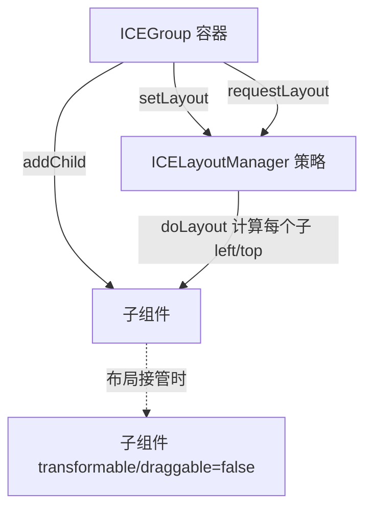

# · 布局机制（Layout）

## 设计目标

容器组件（`ICEGroup` 及其子类）可以持有一个**布局策略**（`ICELayoutManager`），把子组件按某种规则自动排布，而非硬编码坐标。采用 **策略模式**（Swing 风格）：`setLayout(manager)` 持有策略，`doLayout()` 重排。

## 8 种布局

| 布局 | 文件 | 语义 |
|---|---|---|
| `ICELayoutManager` | `ICELayoutManager.ts` | 抽象基类，`doLayout()` / `requestLayout()` |
| `ICEBorderLayout` | `ICEBorderLayout.ts` | 上 / 下 / 左 / 右 / 中 五区 |
| `ICEBoxLayout` | `ICEBoxLayout.ts` | 水平 / 垂直盒，类似 Flexbox |
| `ICEFlowLayout` | `ICEFlowLayout.ts` | 流式（换行），`gap` / `align` |
| `ICEFlowLayout` → | | |
| `ICEGridLayout` | `ICEGridLayout.ts` | 网格（行 × 列） |
| `ICEOverlayLayout` | `ICEOverlayLayout.ts` | 绝对叠加（层） |
| `ICELayeredLayout` | `ICELayeredLayout.ts` | 分层（z 序驱动） |
| `ICECardLayout` | `ICECardLayout.ts` | 卡片（标题 + 内容区） |

## 与组件模型的关系



- 容器一旦设定 `layoutManager`，新加入的子组件会被**禁止手动变换 / 拖动**（`__disableTransformRecursively`），由布局全权负责位置。
- 旧实现只在 `setLayout()` / `addChild()` 时排一次，子项尺寸变化不触发重排；新实现提供 `requestLayout()`，子项尺寸变化可主动触发重排（[13 · 能力缺口](gap-analysis) 相关项）。

## 关键 API

```ts
const group = new ICE.ICEGroup({ ... });
group.setLayout(new ICE.ICEFlowLayout({ gap: 12, align: 'left' }));
group.addChild(a); group.addChild(b);   // 自动按流式布局排布
group.doLayout();                        // 立即重排（或等 requestLayout）
```

> 布局产物是子组件的 `left/top`，最终仍走同一套 [03 · 坐标系](coordinate-system) 与 [04 · 渲染](rendering-performance) 管线，因此布局与动画 / 序列化天然兼容（布局结果可被序列化）。

## 现状与边界

布局是「容器原语」的一部分，当前覆盖常见 2D 排版场景；更复杂的约束布局（如自适应拉伸、对齐到基线网格）仍属应用层职责，引擎只给 `requestLayout` 钩子，不做自动求解（见 [09 · 路线图](roadmap)）。
