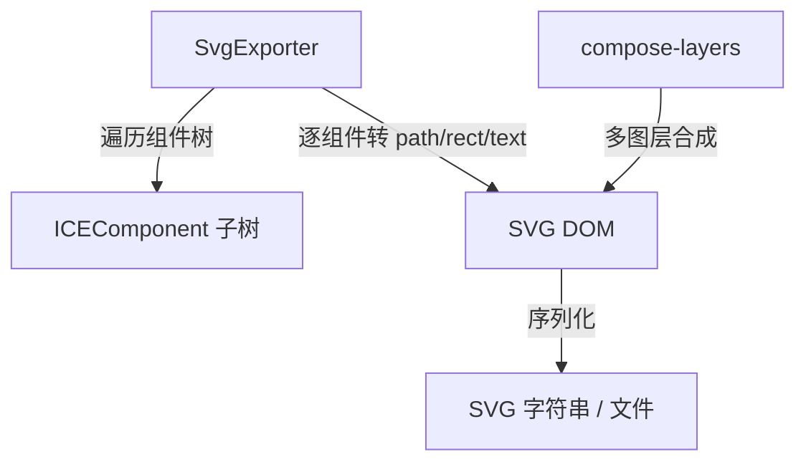

# · 导出机制（Export）

## 设计目标

引擎把画布内容导出为**可编辑 / 可移植**的格式，当前主打 **SVG 矢量导出**（`SvgExporter` + `compose-layers`），与位图截图解耦：矢量在放大、二次编辑、打印场景里无损。

## 结构

- `src/export/SvgExporter.ts` —— 把组件树映射成 SVG 元素（矩形 / 圆 / 路径 / 文本 / 渐变），保留 `state` 里的几何与样式。
- `src/export/compose-layers.ts` —— 多图层合成：把分组 / 控制面板 / 工具节点按需分层导出（工具节点默认排除，除非显式包含）。

## 与序列化机制的区别

- **序列化（[06 · 序列化](serialization)）** 导出的是**引擎内部数据模型**（JSON），可反序列化回 ICE 继续编辑 —— 是「源文件」。
- **导出（Export）** 产出的是**目标格式产物**（SVG），用于下游工具 / 文档 / 打印 —— 是「成品」。两者互补：SVG 不一定能无损反序列化回引擎特有交互（连线端点、动画配置等需回到 JSON）。

## 使用约束

- 导出在浏览器环境最完整（依赖 DOM / `XMLSerializer`）；小程序 / Node 运行时需 polyfill 对应 API（见 [08 · 多运行时兼容](compatibility)）。
- 半透明 / 阴影 / 全局合成等效果在 SVG 里通过 `<filter>` / `opacity` 近似；与 Canvas 像素级一致是目标但非硬性保证，复杂混合建议同时保留位图截图通道。

## 扩展点

导出格式可插件化：新增 `export/xxxExporter.ts` 实现同样的「组件树 → 目标格式」契约即可，无需改动渲染内核。与 [22 · 插件机制](plugin) 的 `render` 钩子不同，导出是**离线遍历**而非每帧叠加。
