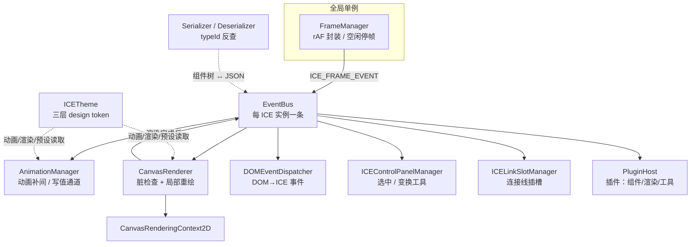

# ICERender 架构设计文档

> 一份关于 ICERender Canvas 2D 渲染引擎的系统性架构说明，作为该引擎的**单一事实来源**（single source of truth），与代码库同仓、随版本演进。
>
> 目标读者：需要二次开发、维护或评审该引擎的工程师。

## 引擎定位

ICERender 是一款 **Canvas 2D 交互图形渲染引擎**（MIT 协议，作者 大漠穷秋）。它借鉴 React 的 `props`/`state` 概念构建组件模型，借鉴 W3C `EventTarget`/jQuery 风格构建事件系统，提供嵌套坐标系、序列化、动画、连接线（Visio 风格）等能力。

**核心设计约束**（贯穿所有子系统的铁律）：

1. **运行时依赖极简** —— 仅 `gl-matrix` 一个库，无其它依赖。
2. **多运行时兼容** —— 同一套代码同时面向 **Web 浏览器**与**各类小程序**（WeChat/Alipay 等），因此不能依赖浏览器专有 API。
3. **高性能** —— 脏标记 + 脏矩形局部重绘（默认，条件回退全量重绘）的渲染模型，配合渲染队列缓存与矩阵零分配，保证数千图元的交互流畅度。

## 子系统模块化设计

引擎**不是一个 monolithic 的渲染器**，而是由一组职责单一的子系统（Manager / 模块）组合而成。每个子系统只解决一类问题，彼此通过 `EventBus` 协作。下面的章节**一个子系统一小节**，逐一拆解其内部机制，并尽量配 **Live Demo**（可直接把玩的在线示例）与 **架构图**。

| 子系统 | 核心模块 | 文档 | Live Demo |
|---|---|---|---|
| 运行时 / 帧管理 | `FrameManager` · `ICE.init` | [01 · 运行时链路](runtime) | — |
| 组件模型 | `ICEComponent` · `props`/`state` · 继承体系 | [02 · 组件模型](component-model) | — |
| 坐标系 / 矩阵 | `composedMatrix` · `gl-matrix` | [03 · 坐标系与矩阵](coordinate-system) | [coordinatecoordinate.html |
| 渲染 / 脏矩形 | `CanvasRenderer` · `dirty-rect-util` | [04 · 渲染与性能](rendering-performance) | [renderingrendering.html |
| **事件机制** | `ICEEventTarget` · `EventBus` · `DOMEventDispatcher` | [05 · 事件系统](event-system) | [eventevent.html |
| **序列化 / 反序列化** | `Serializer` · `Deserializer` · `typeId` | [06 · 序列化](serialization) | [serializationserialization.html |
| 交互与动画 | `ICEControlPanelManager` · `AnimationManager` | [07 · 交互与动画](interaction-animation) | — |
| 多运行时兼容 | `cross-platform/root` · `Path2DRecorder` | [08 · 多运行时兼容](compatibility) | — |
| **动画机制** | `AnimationManager` · `Easing` · `interpolators` · `AnimationTimeline` | [18 · 动画机制](animation-architecture) | [animationanimation.html |
| **Link 机制** | `ICELinkSlotManager` · `ICELinkSlot` · `ICEPolyLine` | [20 · 连线机制](link) | [linklink.html |
| **主题机制** | `ICETheme` · `STYLE_PRESETS` · `resolveTheme` | [19 · 主题机制](theme) | [themetheme.html |
| 控制面板机制 | `ICEControlPanelManager` · `TransformControlPanel` · `LineControlPanel` | [21 · 控制面板](control-panel) | [control-panelcontrol-panel.html |
| 插件机制 | `PluginHost`（组件/渲染/工具三层） | [22 · 插件机制](plugin) | [pluginplugin.html |
| 布局机制 | `ICELayoutManager` · 8 种布局 | [23 · 布局机制](layout) | — |
| 视口缩放 | `getRenderViewport` · 视口矩阵 | [11 · 视口缩放](viewport-zoom) | — |
| 对齐吸附 | `AlignmentGuideManager` | [12 · 对齐吸附](alignment-guide) | — |
| 无障碍原语 | `a11y/accessibility` | [14 · 无障碍原语](accessibility) | — |
| i18n 边界 | 引擎 / 组件库 / 应用 | [17 · i18n 边界](i18n-boundary) | — |
| 导出 | `export/SvgExporter` | [24 · 导出（SVG）](export) | — |
| Worker / Offscreen | Web-only 渲染设计 | [10 · Worker/OffscreenCanvas](worker-offscreen) | — |
| 路线图 / 缺口 | 原语 vs 应用层边界 | [09 · 路线图](roadmap) · [13 · 能力缺口](gap-analysis) | — |

## 子系统协作全景

- `FrameManager` 是**跨 ICE 实例共享**的全局单例，只负责把 rAF 回调转成 `ICE_FRAME_EVENT` 广播，不直接渲染。无总线需要帧时**空闲停帧**（省电），`wake()` 再唤醒。
- 每个 `ICE` 实例持有一条独立的 `EventBus`，各 Manager 通过订阅这条总线协作。
- 渲染由 `CanvasRenderer` 完成，只在 `ice.dirty` 为真时工作；主题（`ICETheme`）是被动画、渲染、组件预设共享读取的「设计 token 单一来源」。
- 序列化（Ser/Des）通过 `typeId` 反查稳定类型名，使数据不依赖打包后的类名。

## 阅读建议

- 想快速理解"一张图怎么画出来"→ 先读 [01 运行时](runtime) 和 [04 渲染](rendering-performance)。
- 想搞清楚"坐标为什么/怎么算"→ 精读 [03 坐标系](coordinate-system)（引擎最核心、最易错的部分）。
- 想扩展自定义组件或接入持久化 → 看 [02 组件模型](component-model) + [06 序列化](serialization)。
- 想做交互式编辑器（选中 / 变换 / 连线 / 插件）→ [21 控制面板](control-panel) + [20 连线](link) + [22 插件](plugin)。
