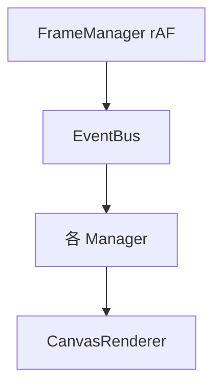

import Tabs from '@theme/Tabs';
import TabItem from '@theme/TabItem';

# 代码展示规范

本文档站统一用 **Docusaurus + Prism** 展示代码。分两类能力：

- **零依赖（已启用）**：普通围栏代码块的高级写法（标题 / 行号 / 高亮 / diff / 多语言 Tabs）、Mermaid 图。开箱即用，不需要装任何包。
- **需安装（升级路径）**：`@docusaurus/theme-live-codeblock`（可编辑运行的代码块）、`remark-code-import`（从真实源码文件导入代码）。本沙箱禁止 `npm install`，配置已写好，**你只需在本地 `npm install` 后即可生效**。

---

## 一、零依赖：把代码块写“优雅”

### 1. 标题 + 行号

围栏信息串加 `title="..."` 与 `showLineNumbers`，右上角出现文件名，左侧出现行号：

````md
```js title="examples/basic/rect.js" showLineNumbers
const rect = new ICE.ICERect({ left: 0, top: 0, width: 160, height: 90 });
ice.addChild(rect);
```
````

```js title="examples/basic/rect.js" showLineNumbers
const rect = new ICE.ICERect({ left: 0, top: 0, width: 160, height: 90 });
ice.addChild(rect);
```

### 2. 高亮指定行

`{行号}` 或 `{起-止}` 高亮关键代码；`{-起-止}` 表示“除这些行外全部高亮”：

````md
```js {2-3}
const a = 1;
const rect = new ICE.ICERect({ left: 0, top: 0, width: 160 });
ice.addChild(rect);
```
````

```js {2-3}
const a = 1;
const rect = new ICE.ICERect({ left: 0, top: 0, width: 160 });
ice.addChild(rect);
```

### 3. diff 片段

语言后加 `diff`，以 `+` / `-` 开头的行自动着色，适合展示“改动前后”：

````md
```diff
- const rect = new ICE.ICERect({ width: 160 });
+ const rect = new ICE.ICERect({ left: 0, top: 0, width: 160, height: 90 });
```
````

```diff
- const rect = new ICE.ICERect({ width: 160 });
+ const rect = new ICE.ICERect({ left: 0, top: 0, width: 160, height: 90 });
```

### 4. 多语言 Tabs

用 `<Tabs>` + `<TabItem>` 给同一段逻辑提供多语言视角（需 `.mdx`）：

````mdx
import Tabs from '@theme/Tabs';
import TabItem from '@theme/TabItem';

<Tabs>
  <TabItem value="js" label="JavaScript" default>
    ```js
    const ice = new ICE.ICE();
    ```
  </TabItem>
  <TabItem value="ts" label="TypeScript">
    ```ts
    const ice: ICE.ICE = new ICE.ICE();
    ```
  </TabItem>
</Tabs>
````

<Tabs>
  <TabItem value="js" label="JavaScript" default>
    ```js
    const ice = new ICE.ICE();
    ```
  </TabItem>
  <TabItem value="ts" label="TypeScript">
    ```ts
    const ice: ICE.ICE = new ICE.ICE();
    ```
  </TabItem>
</Tabs>

### 5. 实时渲染（本仓库特色）

普通代码块只展示文本；要“既看代码又看效果”，用本仓库封装的 `<IceCanvas>`（见[核心概念 · 第一个实时示例](/docs/guide/core-concepts) 与[图元](/docs/guide/shapes)）。它本质是一个 `BrowserOnly` 包裹的客户端组件，加载 `static/ice-render.js` 后即可在浏览器里跑真实 ICE 代码。

---

## 二、可编辑运行的代码块（live-codeblock）✅ 已启用

适合给读者一个**能直接改、立刻看效果**的 React/JSX 沙箱。`@docusaurus/theme-live-codeblock` 基于 `react-live`，纯前端、无服务端。

**1. 安装**：`@docusaurus/theme-live-codeblock@3.10.2` 已装入 `dependencies`（版本与 Docusaurus 对齐）。

**2. 启用** —— `themes` 已加入 `'@docusaurus/theme-live-codeblock'`；同时把 `ice-render.js` 以 `defer` 全局脚本加载，使 `window.ICE` 在任何页面都可用。

**3. 作用域注入 `ICE`** —— swizzle 了 `@theme/ReactLiveScope`，用 getter 延迟暴露 `window.ICE`，因此 `jsx live` 块里能直接写 `ICE.ICERect` / `new ICE.ICE()`（首屏前 `window.ICE` 可能未就绪，块内有 `if (!window.ICE) return` 兜底）。

**4. 用法** —— 语言写 `jsx live`，`title` 可选。下面两个块就是真实可编辑示例，改一改右侧立刻重渲染：

### React 片段

```jsx live
function Counter() {
  const [n, setN] = React.useState(0);
  return (
    <button onClick={() => setN(n + 1)} style={{ padding: 8, fontSize: 16 }}>
      点击了 {n} 次
    </button>
  );
}
```

### ICE 片段（直接操作内核）

下面这段在 live 块里创建了一个 `ICE` 实例并画了一个矩形——改 `fillStyle` 或尺寸，画布立刻重绘：

```jsx live
function IceDemo() {
  const ref = React.useRef(null);
  React.useEffect(() => {
    if (!window.ICE) return;
    const ice = new window.ICE.ICE();
    ice.init(ref.current);
    ice.addChild(
      new window.ICE.ICERect({
        left: 20,
        top: 20,
        width: 160,
        height: 100,
        radius: 12,
        fill: true,
        stroke: true,
        style: { fillStyle: '#4f8cff', strokeStyle: '#1f4fb0', lineWidth: 2 },
      })
    );
    return () => ice.destroy();
  }, []);
  return (
    <canvas
      ref={ref}
      width={200}
      height={140}
      style={{ border: '1px solid #ccc', borderRadius: 8 }}
    />
  );
}
```

### 用法细节

围栏语言写 `jsx live` 即可（可加 `title`）：

````mdx
```jsx live title="可编辑示例"
function Demo() {
  return <button>点我</button>;
}
```
````

- 默认「内联模式」：代码块**最后一行表达式**被渲染（如上例的 `<Counter />`）。
- 需要多条语句 / 自己 `render` 时，加 `noInline`：` ```jsx live noInline `，然后在代码里调用 `render(<Demo />)`。
- 想让更多标识符进作用域（如某个自定义组件），swizzle `@theme/ReactLiveScope` 即可（本仓库已注入 `ICE`）。

> 和 `<IceCanvas>`（见[核心概念 · 第一个实时示例](/docs/guide/core-concepts)）的区别：那里用 `<IceCanvas>` 组件封装了加载 / 生命周期 / `destroy`，适合「展示一个固定示例」；这里的 `jsx live` 适合「让读者自己改代码看效果」。两者底层都是同一个 ICE 内核。

---

## 三、需安装：从真实源码导入代码（remark-code-import）

适合 API 文档——让展示的代码**永远等于仓库里真实存在的源码**，杜绝文档与代码漂移。

**1. 安装**：

```bash
npm install remark-code-import
```

**2. 配置** —— 在 `docusaurus.config.js` 的 `markdown.remarkPlugins` 注册：

```js title="docusaurus.config.js" {1,4}
const remarkCodeImport = require('remark-code-import');

const config = {
  markdown: {
    remarkPlugins: [remarkCodeImport],
  },
};
```

**3. 用法** —— 围栏信息串写 `code-import`，指向相对于当前 `.mdx` 的文件：

````mdx
```ts code-import title="src/core/ICE.ts#L10-L40"
../src/core/ICE.ts
```
````

---

## 四、Mermaid 图（已启用）

`markdown.mermaid: true` 已开。用 ` ```mermaid ` 画架构/时序/流程图：

````mdx

````


---

## 速查

| 能力 | 依赖 | 状态 | 写法 |
|---|---|---|---|
| 标题 / 行号 / 高亮 / diff | 无 | ✅ 已启用 | ` ```js title="..." showLineNumbers {2-3} ` |
| 多语言 Tabs | 无（需 .mdx） | ✅ 已启用 | `<Tabs>` / `<TabItem>` |
| Mermaid | 无（已开 `mermaid:true`） | ✅ 已启用 | ` ```mermaid ` |
| 实时渲染 | 无（`<IceCanvas>`） | ✅ 已启用 | `<IceCanvas setup={...} />` |
| 可编辑运行 | `@docusaurus/theme-live-codeblock` | ✅ 已启用 | ` ```jsx live ` |
| 导入真实源码 | `remark-code-import` | 🔲 需安装 | ` ```ts code-import ` |
